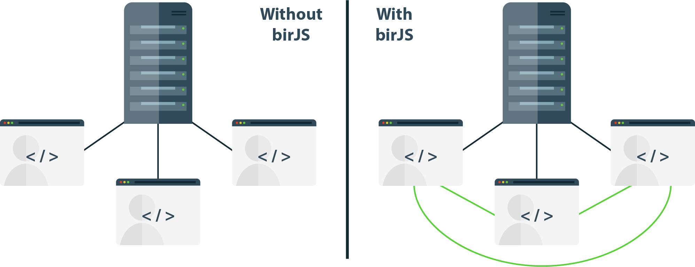

# birJS  

 

birJS is a JavaScript library, who share datas via a peer to peer chanel.

## How it's work
Using WebRTC we connect clients to make peer to peer connection possible and easy.

 

The library give developers an **easy way** to get data from the **peer to peer** network.

The idea behind is to **remove** the bigest part of the **data redundancy** of the network.

## Installation
* Git clone the repository
* You are going to need nodeJS and npm
* on the server folder ``> npm install``
* on your web html pasge add the js/bir.js script with ``2.1.1/socket.io.js`` and ``webrtc-adapter/6.4.0/adapter.js``

## Documentation

## Examples
The folder **example** show you a brief example of how to use the birJS library.
* Launch the server, ``> npm start`` from the server folder
* look the url.html page
* on the page you can load an API content or an image from the two buttons, the border color mean:
* * red = data from the server
* * green = data from another peer
* * blue = data from local

ps: you an see the debug mode buy uncomment the ligne 65: `` // bir.setDebug(true); `` of url.html

## Contributing

